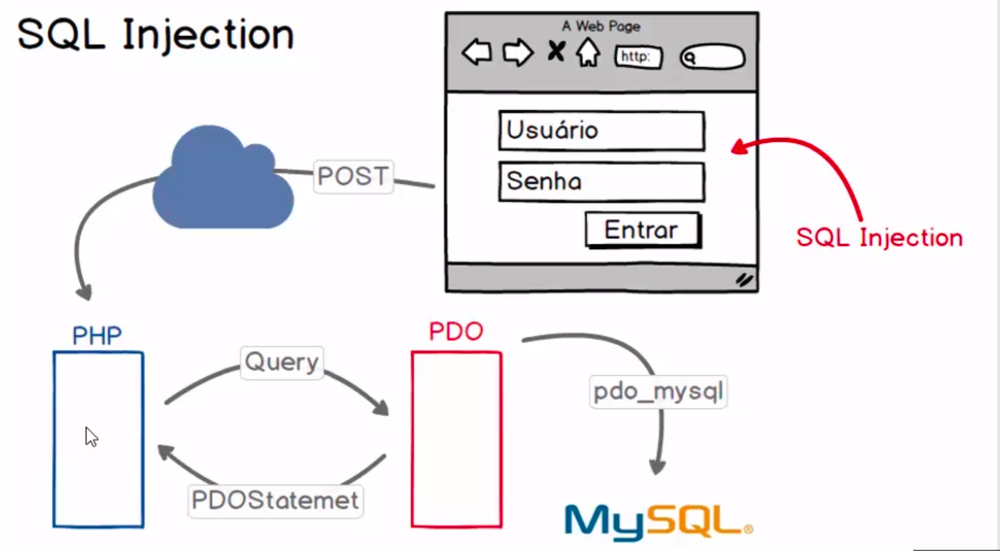
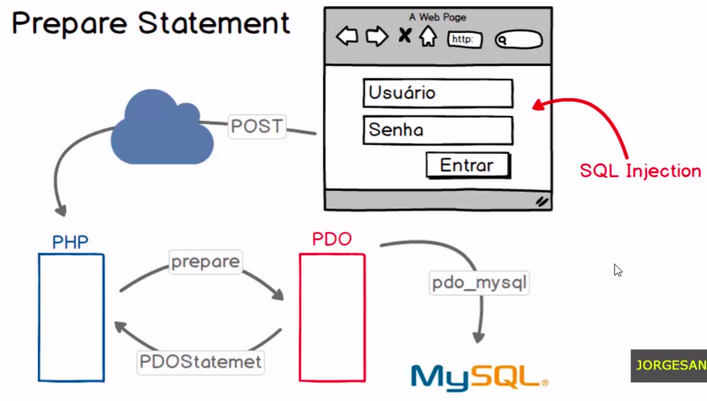

# Introdução ao PDO

documentação: https://www.php.net/manual/en/book.pdo.php

### PHP Data Objects:

- O PHP Data Objects é uma extensão que permite ao PHP se comunicar com diversos tipos de bancos de dados.

- O recurso fornece um meio abstrato para acesso às informações disponibilizadas pelos bancos, sendo os seus métodos independentes para cada um dos tipos suportados

- O PDO é orientado a objetos.

### Para que serve o PDO?

- Sua principal finalidade é oferecer uma interface consistente e segura para interagir com bancos de dados, independentemente do sistema de gerenciamento de banco de dados (SGBD) subjacente.

- Prover uma padronização da forma com que o php se comunica com bancos de dados. 
- Os objetos são agregados no php em formato de extenção. 
- Os objetos pode ser habilitado ou desabilitados atravez do arquivo php ini

### Qual a vantagem de se trabalhar com PDO?

- **Abstração de Banco de Dados:** 
  * O PDO fornece uma camada de abstração que permite que os desenvolvedores escrevam código que seja independente do banco de dados específico. Isso facilita a migração de um sistema para outro, pois você pode trocar o SGBD subjacente sem precisar modificar significativamente o código.

- **Segurança:** 
  * O PDO utiliza declarações preparadas e vinculação de parâmetros, o que ajuda a prevenir ataques de injeção de SQL. Esse é um aspecto crítico para garantir a segurança das aplicações web, evitando que dados não confiáveis causem danos ao banco de dados.

- **Suporte a Transações:** 
  * O PDO oferece suporte a transações, permitindo que você execute várias consultas como uma única unidade atômica. Isso é útil em operações que exigem consistência no banco de dados, como transferências de fundos em um sistema bancário.

- **Suporte a Diferentes Bancos de Dados:** 
  * Com o PDO, é possível conectar-se a vários tipos de bancos de dados, como MySQL, PostgreSQL, SQLite, Microsoft SQL Server, entre outros. Isso proporciona flexibilidade no desenvolvimento de aplicativos que podem precisar interagir com diferentes sistemas de gerenciamento de banco de dados.

- **Gerenciamento de Erros:** 
  * O PDO oferece recursos avançados para gerenciamento de erros, permitindo que os desenvolvedores capturem e lidem com exceções de maneira mais eficaz, facilitando a depuração e a manutenção do código.

# Criando uma conexão entre o PHP e o MySQL com PDO

## Cria a instancia de conexão

    $conexao = new PDO($dsn, $usuario, $senha);

#### primeiro parametro:
   
- Data Source Name (DSN) ou Nome da Fonte de Dados
-  prefixo mysql diz qual o drive que sera utilizado
- host que pode ser local ou com o endereço aonde o banco se encontra 
- qual o banco de dados vai ser acessado

        $dsn = 'mysql:host=localhost;dbname=php_pdo';

#### segundo parametro:
- usuario do banco de dados

        $usuario = 'root'; 

#### terceiro parametro:
- senha do banco de dados

        $senha = '';

## Tratando exceptions (PDOException)
documentação: https://www.php.net/manual/en/class.pdoexception.php

- quando ocorre um erro, o PDO recupera esse erro e produz uma exception e pode ser capturada pelo php e ser tratado.

- PDOException é um objeto dentro de PDO que sera populado com as informações do erro

Neste exemplo temos um erro proposital no dsn:

        <?php
                $dsn = 'mysql:host=localhost;dbname=xphp_pdo';
                $usuario = 'root';
                $senha = '';

                try{
                        $conexao = new PDO($dsn, $usuario, $senha);
                }
                catch(PDOException $e){
                        echo '<pre>';
                        print_r($e);
                        echo '</pre>';
                }
        ?>

Esse erro gera este objeto contendo atributos protegidos.

Os metodos podem ser conferidos na documentação.

        PDOException Object
        (
                [message:protected] => SQLSTATE[HY000] [1049] Unknown database 'xphp_pdo'
                [string:Exception:private] => 
                [code:protected] => 1049
                [file:protected] => /opt/lampp/htdocs/php_pdo/index.php
                [line:protected] => 7
                [trace:Exception:private] => Array
                (
                        [0] => Array
                        (
                                [file] => /opt/lampp/htdocs/php_pdo/index.php
                                [line] => 7
                                [function] => __construct
                                [class] => PDO
                                [type] => ->
                                [args] => Array
                                (
                                        [0] => mysql:host=localhost;dbname=xphp_pdo
                                        [1] => root
                                        [2] => SensitiveParameterValue Object
                                )
                        )
                )

                [previous:Exception:private] => 
                [errorInfo] => Array
                (
                        [0] => HY000
                        [1] => 1049
                        [2] => Unknown database 'xphp_pdo'
                )
        )

Podemos pegar o codigo do erro e a mensagem do erro para tratar o erro no php, assim produzindo uma mensagem na tela ou criando uma logica mais agradavel para a aplicação.

        atributos:
                [code:protected] => 1049
                [message:protected] => SQLSTATE[HY000] [1049] Unknown database 'xphp_pdo'

        metodos:
                final public Exception::getCode(): int
                final public Exception::getMessage(): string

No php voce trata esse erro:

        <?php
                $dsn = 'mysql:host=localhost;dbname=xphp_pdo';
                $usuario = 'root';
                $senha = '';

                try{
                        $conexao = new PDO($dsn, $usuario, $senha);
                }catch(PDOException $e){
                        echo 'Erro: '. $e->getCode(). ' Mensagem: '. $e->getMessage();
                        //registrar o erro de alguma forma.
                }
        ?>

## Executando instruções SQL(Exec)

#### metodo **exec()**
- **PDO::exec** — Executa uma instrução SQL e retorna o número de linhas afetadas
- **PDO::exec()** retorna o número de linhas que foram modificadas ou excluídas pela instrução SQL que você emitiu. Se nenhuma linha for afetada, **PDO::exec()** retorna `0`.
- Instruções de **DDL** sempre retorna `0`, pois não esta modificando dados

Primeiro precisamos montar a query que queremos executar:

        $query = '
                create table if not exists tb_usuarios(
                        id int not null primary key auto_increment,
                        nome varchar (50) not null,
                        email varchar(100) not null,
                        senha varchar(32) not null
                )
        ';

Agora, apartir do objeto criado como conexão, utiliza a função **exec** passando a query criada como parametro:

        $retorno = $conexao->exec($query); //retorno 0, pois nao estamos modificando registros

ex:

        <?php
                $dsn = 'mysql:host=localhost;dbname=php_pdo';
                $usuario = 'root';
                $senha = '';

                try{
                        $conexao = new PDO($dsn, $usuario, $senha);

                        $query = '
                        CREATE TABLE if not exists tb_usuarios(
                                id int not null primary key auto_increment,
                                nome varchar (50) not null,
                                email varchar(100) not null,
                                senha varchar(32) not null
                        );
                        ';

                        $retorno = $conexao->exec($query);
                        echo $retorno;

                        $query = '
                                insert into tb_usuarios(
                                nome, email, senha 
                                ) values (
                                "Jorge Sant Ana", "jorge@teste.com.br", "123456"
                                )
                        ';

                        $retorno = $conexao->exec($query);
                        echo $retorno;

                        $query = '
                                delete from tb_usuarios
                        ';

                        $retorno = $conexao->exec($query);
                        echo $retorno;

                }catch(PDOException $e){
                        // echo '<pre>';
                        //     print_r($e);
                        // echo '</pre>';

                        echo 'Erro: '. $e->getCode(). ' Mensagem: '. $e->getMessage();
                        //registrar o erro de alguma forma.
                }
        ?>

## PDOStatement Object (Query) com fetchAll

documentação: https://www.php.net/manual/en/pdo.query.php

- ideal para query de consultas como o **SELECT**
- retorna os dados da consulta

O metodo query retorna um PDOStatement:

        $stmt = $conexao->query($query);

A variavel stmt apenas contem a declaração da consulta:

        PDOStatement Object ( [queryString] => select * from tb_usuarios )

A partir da variavel **$stmt** podemos executar metodos para ter acesso aos dados recuperados do banco de dados

O metodo **fetchAll()** retorna todos os registros recuperados da consulta:

        $lista = $stmt->fetchAll();

Imprimindo a variavel lista tera um array com todo o resultado da consulta:

        echo '<pre>';
            print_r($lista);
        echo '</pre>';

- Um detalhe importante é que as informações são retornados de dois modos diferentes 
- Utilizando índices associativos que recebem os nomes das colunas.
- Esses índices associativos portanto nada mais são do que os nomes das colunas da tabela da qual fizemos a consulta.

- Mas é possível também recuperar esses valores utilizando índices numéricos.

        Array
        (
        [0] => Array
                (
                [id] => 6
                [0] => 6
                [nome] => Vitor Gesteira
                [1] => Vitor Gesteira
                [email] => vitor@teste.com.br
                [2] => vitor@teste.com.br
                [senha] => 123456
                [3] => 123456
                )

        [1] => Array
                (
                [id] => 7
                [0] => 7
                [nome] => carlos Almeida
                [1] => carlos Almeida
                [email] => carlos@teste.com.br
                [2] => carlos@teste.com.br
                [senha] => 123456
                [3] => 123456
                )

        [2] => Array
                (
                [id] => 8
                [0] => 8
                [nome] => Bianca da Silva
                [1] => Bianca da Silva
                [email] => bianca@teste.com.br
                [2] => bianca@teste.com.br
                [senha] => 123456
                [3] => 123456
                )

        )

Nós podemos tranquilamente acessar os índices desejados. Da mesma forma que consultamos o array:

        echo $lista[2]['email'];
        echo $lista[0][1];

## Fetchall - Tipos de retornos

- Ao utilizar o método fetchAll do PDO para recuperar todos os resultados de uma consulta, você também pode especificar diferentes estilos para o array resultante.

- Aqui estão alguns dos tipos comuns de fetchAll:

  * `PDO::FETCH_ASSOC`: Retorna um array de arrays associativos, onde cada elemento representa uma linha da consulta, indexada pelo nome da coluna.

        $lista = $stmt->fetchAll(PDO::FETCH_ASSOC);

  * retorno:

        Array
        (
                [0] => Array
                (
                        [id] => 6
                        [nome] => Vitor Gesteira
                        [email] => vitor@teste.com.br
                        [senha] => 123456
                )

                [1] => Array
                (
                        [id] => 7
                        [nome] => carlos Almeida
                        [email] => carlos@teste.com.br
                        [senha] => 123456
                )

                [2] => Array
                (
                        [id] => 8
                        [nome] => Bianca da Silva
                        [email] => bianca@teste.com.br
                        [senha] => 123456
                )
        )

  * `PDO::FETCH_NUM`: Retorna um array de arrays indexados numericamente, onde cada elemento representa uma linha da consulta.

        $lista = $stmt->fetchAll(PDO::FETCH_NUM);

  * retorno:

        Array
        (
                [0] => Array
                (
                        [0] => 6
                        [1] => Vitor Gesteira
                        [2] => vitor@teste.com.br
                        [3] => 123456
                )

                [1] => Array
                (
                        [0] => 7
                        [1] => carlos Almeida
                        [2] => carlos@teste.com.br
                        [3] => 123456
                )

                [2] => Array
                (
                        [0] => 8
                        [1] => Bianca da Silva
                        [2] => bianca@teste.com.br
                        [3] => 123456
                )
        )

  * `PDO::FETCH_BOTH`: Retorna um array de arrays indexados tanto pelo nome quanto pelo índice numérico.

        $lista = $stmt->fetchAll(PDO::FETCH_BOTH);

  * retorno:

        Array
        (
                [0] => Array
                (
                        [id] => 6
                        [0] => 6
                        [nome] => Vitor Gesteira
                        [1] => Vitor Gesteira
                        [email] => vitor@teste.com.br
                        [2] => vitor@teste.com.br
                        [senha] => 123456
                        [3] => 123456
                )

                [1] => Array
                (
                        [id] => 7
                        [0] => 7
                        [nome] => carlos Almeida
                        [1] => carlos Almeida
                        [email] => carlos@teste.com.br
                        [2] => carlos@teste.com.br
                        [senha] => 123456
                        [3] => 123456
                )

                [2] => Array
                (
                        [id] => 8
                        [0] => 8
                        [nome] => Bianca da Silva
                        [1] => Bianca da Silva
                        [email] => bianca@teste.com.br
                        [2] => bianca@teste.com.br
                        [senha] => 123456
                        [3] => 123456
                )
        )

  * `PDO::FETCH_OBJ`: Retorna um array de objetos anônimos, onde cada objeto tem propriedades que correspondem aos nomes das colunas.

        $lista = $stmt->fetchAll(PDO::FETCH_OBJ);

  * retorno:

        Array
        (
                [0] => stdClass Object
                (
                        [id] => 6
                        [nome] => Vitor Gesteira
                        [email] => vitor@teste.com.br
                        [senha] => 123456
                )

                [1] => stdClass Object
                (
                        [id] => 7
                        [nome] => carlos Almeida
                        [email] => carlos@teste.com.br
                        [senha] => 123456
                )

                [2] => stdClass Object
                (
                        [id] => 8
                        [nome] => Bianca da Silva
                        [email] => bianca@teste.com.br
                        [senha] => 123456
                )
        )

- Lembre-se de que a escolha entre esses estilos depende da estrutura dos dados que você espera e das necessidades específicas do seu código. Certifique-se de consultar a documentação oficial do PHP para obter informações detalhadas sobre cada estilo:

## Fetch - Retornando apenas um registro

- Se você deseja retornar apenas um registro utilizando o método fetch no PDO, você pode fazer isso de várias maneiras. Aqui estão algumas opções:

  * Fetch Associativo:

        $usuario = $stmt->fetch(PDO::FETCH_ASSOC); 

        echo $usuario['nome'];

  * retorno:

        Array
        (
                [id] => 6
                [nome] => Vitor Gesteira
                [email] => vitor@teste.com.br
                [senha] => 123456
        )

        Vitor Gesteira

  * Fetch Numérico:

        $usuario = $stmt->fetch(PDO::FETCH_NUM);

        echo $usuario[2];

  * retorno:

        Array
        (
                [0] => 6
                [1] => Vitor Gesteira
                [2] => vitor@teste.com.br
                [3] => 123456
        )

        vitor@teste.com.br

  * Fetch como Objeto:

        $usuario = $stmt->fetch(PDO::FETCH_OBJ);

        echo $usuario->nome;

  * retorno:

        stdClass Object
        (
                [id] => 6
                [nome] => Vitor Gesteira
                [email] => vitor@teste.com.br
                [senha] => 123456
        )

        Vitor Gesteira

- Lembre-se de que o método fetch retorna a próxima linha do conjunto de resultados como especificado pelo estilo que você fornece como argumento. Uma vez que você tenha obtido um registro, não será mais possível acessar registros subsequentes diretamente usando fetch. Se você deseja iterar por todos os registros, pode usar um loop como demonstrado assegir.

        $usuario = $stmt->fetch(PDO::FETCH_ASSOC);
        while ($usuario !== false) {
                echo "Nome: " . $usuario['nome'] . " - Email: " . $usuario['email'] . " - Senha: " . $usuario['senha'] . " ";
                $usuario = $stmt->fetch(PDO::FETCH_ASSOC);
        }

## Listando registros com Foreach

- Listar registros utilizando foreach é uma prática comum em PHP quando você está trabalhando com conjuntos de resultados, como os obtidos a partir de consultas em bancos de dados.

- Esse código PHP realiza uma consulta à tabela `tb_usuarios` em um banco de dados usando PDO (PHP Data Objects), recupera os resultados e, em seguida, itera sobre esses resultados para imprimir o valor da coluna `nome` de cada registro.

- Aqui está uma explicação passo a passo do código:

**1. Definição da Consulta SQL:**

        $query = '
                select * from tb_usuarios 
        ';
* Define uma consulta SQL para selecionar todos os campos (`*`) da tabela `tb_usuarios`

**2. Execução da Consulta:** 

        $stmt = $conexao->query($query); //PDO Statemet

   * Utiliza o método `query` do objeto PDO (`$conexao`) para executar a consulta SQL. O resultado é armazenado em um objeto `PDOStatement` chamado `$stmt`.

**3. Recuperação dos Resultados:**

        $lista_usuario = $stmt->fetchAll(PDO::FETCH_ASSOC); //retornará arrays

   * Utiliza o método `fetchAll` para recuperar todos os resultados da consulta como um array associativo (`PDO::FETCH_ASSOC`). Isso significa que cada linha do resultado será representada como um array associativo, onde as chaves são os nomes das colunas e os valores são os dados.

 **4. Iteração sobre os Resultados com `foreach`:**

        foreach($lista_usuario as $key => $value) {
            // print_r($value);
            echo $value['nome'];
            echo '
';
        }
        
* Utiliza um loop `foreach` para iterar sobre o array `$lista_usuario`, onde cada elemento é um array associativo representando um registro da tabela

* `echo $value['nome'];` imprime o valor da coluna 'nome' para cada registro.

* `echo '
';` imprime uma linha horizontal para separar visualmente os resultados.

Ao final do processo, o código imprimirá os nomes dos usuários da tabela `tb_usuarios` com uma linha horizontal entre cada nome. É uma maneira comum de recuperar e exibir dados de um banco de dados usando PHP e PDO.

        Vitor Gesteira
        carlos Almeida
        Bianca da Silva

**Ou o codigo tambem pode ser feita dessa forma:**

**1. Definição da Consulta SQL:**

        $query = '
            select * from tb_usuarios 
        ';

  * Define uma string contendo uma consulta SQL que seleciona todos os campos (`*`) da tabela `tb_usuarios`.

**2. Execução da Consulta e Iteração sobre os Resultados com `foreach`:**

        foreach($conexao->query($query) as $chave => $valor){
            print_r($valor['nome']);
            echo '
';
        }

  * Utiliza o método `query` do objeto PDO (`$conexao`) para executar a consulta SQL e retorna um conjunto de resultados.

  * O `foreach` é usado para iterar sobre esses resultados.

  * Cada iteração de `foreach` representa uma linha do resultado.

  * `$valor` é um array associativo representando os dados de uma linha, onde as chaves são os nomes das colunas e os valores são os dados.

  * `print_r($valor['nome']);` imprime o valor da coluna 'nome' para cada registro.

  * `echo '
';` imprime uma linha horizontal (`
`) para separar visualmente os resultados na saída.

- Em resumo, este código realiza uma consulta à tabela tb_usuarios, obtém os resultados e os exibe na tela, imprimindo os nomes dos usuários com uma linha horizontal entre cada nome. Essa abordagem é eficaz para iteração direta sobre o resultado sem a necessidade de armazenar todos os registros em uma variável antes de processá-los.

## SQL Injection

- A injeção de SQL é uma vulnerabilidade de segurança que ocorre quando um aplicativo web permite que um invasor insira código SQL não desejado em uma consulta.
- Para evitar a injeção de SQL ao usar o PDO em PHP, é crucial usar declarações preparadas e parâmetros vinculados.

- Este código PHP está vulnerável a ataques de injeção de SQL, o que pode comprometer a segurança do sistema. 

        <?php   
        // print_r($_POST);
        if(!empty($_POST['usuario']) && !empty($_POST['senha'])){
                $dsn = 'mysql:host=localhost;dbname=php_pdo';
                $usuario = 'root';
                $senha = '';

                try{
                $conexao = new PDO($dsn, $usuario, $senha);

                //query
                $query = "select * from tb_usuarios where ";
                $query .= " email = '{$_POST['usuario']}' ";
                $query .= " AND senha = '{$_POST['senha']}' ";
                echo $query;

                $stm = $conexao->query($query);
                $usuario = $stm->fetch();

                echo "<pre>";
                // print_r($usuario);   
                echo "</pre>";
        
                }catch(PDOException $e){
                echo 'Erro: '. $e->getCode(). ' Mensagem: '. $e->getMessage();
                }
        }
        ?>

        <html>
        <head>
                <meta charset="utf-8">
                <title>Login</title>
        </head>
        <body>
        <form method="post" action="sql_injection.php">
                <input type="text" placeholder="usuário" name="usuario">
                 
                <input type="password" placeholder="senha" name="senha">
                 
                <button type="submit">Entrar</button>
        </form>
        </body>
        </html>

- Se for em inspecionar no navegador e modificar o campo do input password para text e injetar esse texto no campo de senha do front end e enviar:

        1234'; delete from tb_usuarios where 'a' = 'a

- O php vai concatenar na query e executar no banco, assim fazendo a consulta no banco e logo em seguida executando o delete apagando todos os registros:

        select * from tb_usuarios where email = 'vitor@teste.com.br' AND senha = '123456'; delete from tb_usuarios where 'a' = 'a'

Aqui estão os problemas principais:

**1. Concatenação direta na string SQL:**

        $query .= " email = '{$_POST['usuario']}' ";
        $query .= " AND senha = '{$_POST['senha']}' ";

  * Aqui, os valores `$_POST['usuario']` e `$_POST['senha']` são diretamente concatenados na string da consulta SQL. 

  * Isso torna a aplicação vulnerável a injeção de SQL, onde um invasor pode manipular os dados de entrada para realizar operações não autorizadas no banco de dados.

**2. Ausência de preparação de consultas:**

  * Não há uso de declarações preparadas (prepared statements) no código para proteger contra injeção de SQL. Utilizar declarações preparadas é uma prática essencial para garantir a segurança ao trabalhar com consultas SQL.
  * Para corrigir isso, você deve usar declarações preparadas e vincular os parâmetros da consulta. 

## Prepare Statement

documentação: https://www.php.net/manual/en/pdostatement.bindvalue

documentação: https://www.php.net/manual/en/pdo.constants.php

- O `PDO::prepare()` é um método fundamental da extensão PDO (PHP Data Objects) que é utilizado para criar e preparar consultas SQL antes de serem executadas. 
- Ele é parte integrante da técnica de "Prepared Statements" em PHP, que é uma abordagem recomendada para executar consultas de maneira segura e eficiente.

- A sequência típica de uso do `PDO::prepare()` envolve os seguintes passos:

**1. Criação da Consulta SQL com Marcadores de Posição:**

- A consulta SQL é definida com marcadores de posição para os parâmetros. Esses marcadores de posição são representados por dois-pontos seguidos de um identificador único (por exemplo, `:usuario`, `:senha`).

        $query = "select * from tb_usuarios where email = :usuario AND senha = :senha ";
        
**2. Preparação da Consulta:**

- A consulta SQL é então passada para o método `PDO::prepare()`, que retorna um objeto `PDOStatement`. 
- Este objeto representa a consulta preparada e contém informações sobre ela.

        $stmt = $conexao->prepare($query);

**3. Associação de Parâmetros:**

- Em seguida, os valores dos parâmetros são associados aos marcadores de posição usando métodos como `bindParam()` ou `bindValue()` no objeto `PDOStatement`.

        $stmt->bindValue(':usuario', $_POST['usuario']);
        $stmt->bindValue(':senha', $_POST['senha'], PDO::PARAM_INT);

        $stmt->bindParam(':usuario', $_POST['usuario']);
        $stmt->bindParam(':senha', $idade, $_POST['senha']);
        
- Note que `bindParam()` e `bindValue()` diferem na forma como lidam com a referência ao valor. 
- `bindParam()` permite a vinculação por referência, o que significa que o valor da variável é atualizado quando o parâmetro é executado. 
- `bindValue()` passa o valor atual da variável.

**4. Execução da Consulta:**

- Após a preparação e associação de parâmetros, a consulta preparada pode ser executada usando o método `execute()`.

        $stmt->execute();

- O uso de "Prepared Statements" com o `PDO::prepare()` traz benefícios significativos em termos de segurança e desempenho, ajudando a prevenir a injeção de SQL e permitindo a reutilização eficiente de consultas SQL com diferentes conjuntos de dados.

**obs:** O terceiro parâmetro da função `bindValue()` é opcional e é conhecido como o "tipo de dado" ou "data type." Esse parâmetro permite especificar explicitamente o tipo de dados do valor que está sendo vinculado ao marcador de posição.

O terceiro parâmetro, `$data_type`, aceita um valor opcional que indica o tipo de dados do valor que está sendo vinculado. Alguns dos valores possíveis para `$data_type` incluem:

- `PDO::PARAM_STR`: Indica que o valor é uma string.
- `PDO::PARAM_INT`: Indica que o valor é um inteiro.
- `PDO::PARAM_BOOL`: Indica que o valor é um booleano.
- `PDO::PARAM_NULL`: Indica que o valor é NULL.

Ao especificar o tipo de dados, você está informando ao PDO como deve tratar o valor quando ele for incluído na consulta SQL. Isso pode ser útil para garantir que o valor seja tratado corretamente, especialmente em casos onde a conversão automática de tipos pode não ser suficiente.

Exemplo de uso da função `bindValue()` com o terceiro parâmetro:

        $stmt->bindValue(':senha', $_POST['senha'], PDO::PARAM_INT);

- Neste exemplo, estamos vinculando a variável `$senha` ao marcador de posição `:senha` e indicando que seu tipo é um inteiro (`PDO::PARAM_INT`). Isso garante que o PDO trate o valor como um inteiro ao inseri-lo na consulta preparada.

- É importante observar que, na maioria dos casos, o PDO faz uma boa inferência sobre o tipo de dados automaticamente. No entanto, em situações onde a especificação explícita do tipo de dados é necessária, o uso do terceiro parâmetro da função `bindValue()` pode ser benéfico.

         1234'; delete from tb_usuarios where 'a' = 'a

- Nessa entrada de dados, o terceiro parâmetro da função bindValue() desempenha um papel zcrucial ao especificar o tipo de dados do valor associado ao marcador de posição. Ao configurá-lo para PDO::PARAM_INT, estamos indicando explicitamente que o valor vinculado é um inteiro. Isso não apenas facilita a conversão adequada do valor, mas também desempenha um papel crítico na segurança da consulta SQL.

- Ao definir o tipo de dados como PDO::PARAM_INT, estamos instruindo o PDO a tratar o valor como um número inteiro, o que é particularmente relevante quando se trata de consultas que envolvem operações como exclusões (DELETE). Isso oferece uma camada adicional de segurança, impedindo a possibilidade de uma injeção de SQL mal-intencionada, onde um invasor poderia manipular a consulta para incluir instruções deletérias.

- Dessa forma, ao utilizar o terceiro parâmetro para especificar o tipo de dados como PDO::PARAM_INT, estamos assegurando que o PDO interprete corretamente o valor como um inteiro, contribuindo para a integridade da consulta SQL e prevenindo possíveis ameaças de segurança associadas à injeção de SQL.

        