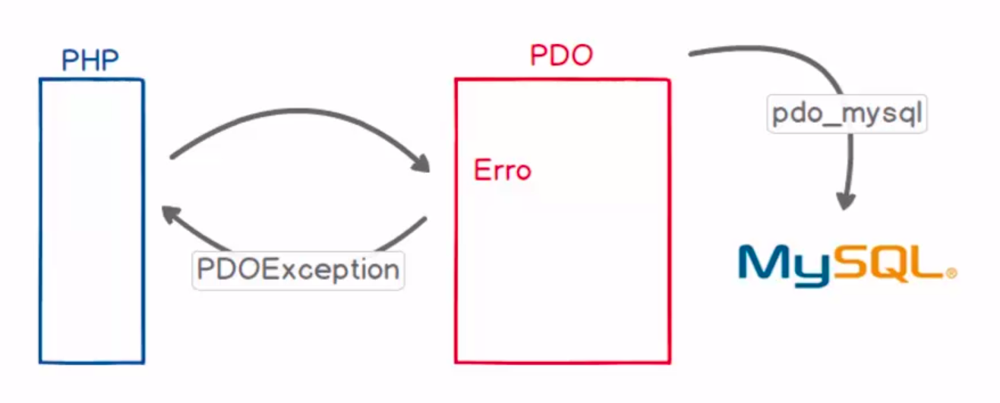
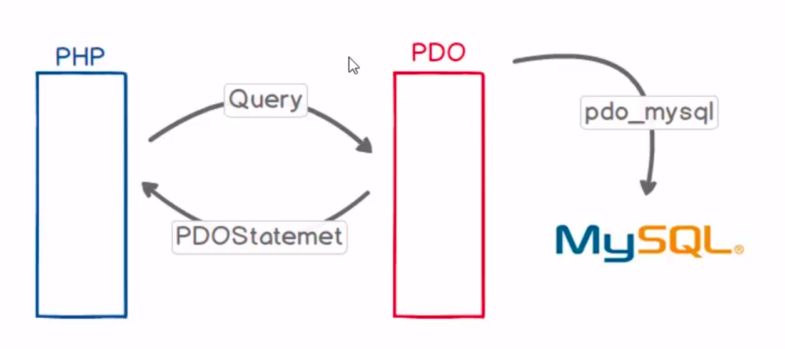

# Introdução ao PDO

documentação: https://www.php.net/manual/en/book.pdo.php

PHP Data Objects:

    Conjuntos de objetos que auxilia no trabalho com banco de dados.

Para que serve o PDO?

    Prover uma padronização da forma com que o php se comunica com bancos de dados. Os objetos são agregados no php em formato de extenção. Os objetos pode ser habilitado ou desabilitados atravez do arquivo php ini

Qual a vantagem de se trabalhar com PDO?

# Criando uma conexão entre o PHP e o MySQL com PDO

## Cria a instancia de conexão

    $conexao = new PDO($dsn, $usuario, $senha);

#### primeiro parametro:
   
- Data Source Name (DSN) ou Nome da Fonte de Dados
-  prefixo mysql diz qual o drive que sera utilizado
- host que pode ser local ou com o endereço aonde o banco se encontra 
- qual o banco de dados vai ser acessado

        $dsn = 'mysql:host=localhost;dbname=php_pdo';

#### segundo parametro:
- usuario do banco de dados

        $usuario = 'root'; 

#### terceiro parametro:
- senha do banco de dados

        $senha = '';

## Tratando exceptions (PDOException)
documentação: https://www.php.net/manual/en/class.pdoexception.php

- quando ocorre um erro, o PDO recupera esse erro e produz uma exception e pode ser capturada pelo php e ser tratado.

- PDOException é um objeto dentro de PDO que sera populado com as informações do erro

Neste exemplo temos um erro proposital no dsn:

        <?php
                $dsn = 'mysql:host=localhost;dbname=xphp_pdo';
                $usuario = 'root';
                $senha = '';

                try{
                        $conexao = new PDO($dsn, $usuario, $senha);
                }
                catch(PDOException $e){
                        echo '<pre>';
                        print_r($e);
                        echo '</pre>';
                }
        ?>

Esse erro gera este objeto contendo atributos protegidos.

Os metodos podem ser conferidos na documentação.

        PDOException Object
        (
                [message:protected] => SQLSTATE[HY000] [1049] Unknown database 'xphp_pdo'
                [string:Exception:private] => 
                [code:protected] => 1049
                [file:protected] => /opt/lampp/htdocs/php_pdo/index.php
                [line:protected] => 7
                [trace:Exception:private] => Array
                (
                        [0] => Array
                        (
                                [file] => /opt/lampp/htdocs/php_pdo/index.php
                                [line] => 7
                                [function] => __construct
                                [class] => PDO
                                [type] => ->
                                [args] => Array
                                (
                                        [0] => mysql:host=localhost;dbname=xphp_pdo
                                        [1] => root
                                        [2] => SensitiveParameterValue Object
                                )
                        )
                )

                [previous:Exception:private] => 
                [errorInfo] => Array
                (
                        [0] => HY000
                        [1] => 1049
                        [2] => Unknown database 'xphp_pdo'
                )
        )

Podemos pegar o codigo do erro e a mensagem do erro para tratar o erro no php, assim produzindo uma mensagem na tela ou criando uma logica mais agradavel para a aplicação.

        atributos:
                [code:protected] => 1049
                [message:protected] => SQLSTATE[HY000] [1049] Unknown database 'xphp_pdo'

        metodos:
                final public Exception::getCode(): int
                final public Exception::getMessage(): string

No php voce trata esse erro:

        <?php
                $dsn = 'mysql:host=localhost;dbname=xphp_pdo';
                $usuario = 'root';
                $senha = '';

                try{
                        $conexao = new PDO($dsn, $usuario, $senha);
                }catch(PDOException $e){
                        echo 'Erro: '. $e->getCode(). ' Mensagem: '. $e->getMessage();
                        //registrar o erro de alguma forma.
                }
        ?>

## Executando instruções SQL(Exec)

- metodo **exec()**
- **PDO::exec** — Executa uma instrução SQL e retorna o número de linhas afetadas
- **PDO::exec()** retorna o número de linhas que foram modificadas ou excluídas pela instrução SQL que você emitiu. Se nenhuma linha for afetada, **PDO::exec()** retorna 0.
- Instruções de **DDL** sempre retorna **0**, pois não esta modificando dados

Primeiro precisamos montar a query que queremos executar:

        $query = '
                create table if not exists tb_usuarios(
                        id int not null primary key auto_increment,
                        nome varchar (50) not null,
                        email varchar(100) not null,
                        senha varchar(32) not null
                )
        ';

Agora, apartir do objeto criado como conexão, utiliza a função **exec** passando a query criada como parametro:

        $retorno = $conexao->exec($query); //retorno 0, pois nao estamos modificando registros

ex:

        <?php
                $dsn = 'mysql:host=localhost;dbname=php_pdo';
                $usuario = 'root';
                $senha = '';

                try{
                        $conexao = new PDO($dsn, $usuario, $senha);

                        $query = '
                        CREATE TABLE if not exists tb_usuarios(
                                id int not null primary key auto_increment,
                                nome varchar (50) not null,
                                email varchar(100) not null,
                                senha varchar(32) not null
                        );
                        ';

                        $retorno = $conexao->exec($query);
                        echo $retorno;

                        // $query = '
                        //         insert into tb_usuarios(
                        //             nome, email, senha 
                        //         ) values (
                        //             "Jorge Sant Ana", "jorge@teste.com.br", "123456"
                        //         )
                        // ';

                        $query = '
                                delete from tb_usuarios
                        ';

                        $retorno = $conexao->exec($query);
                        echo $retorno;

                }catch(PDOException $e){
                        // echo '<pre>';
                        //     print_r($e);
                        // echo '</pre>';

                        echo 'Erro: '. $e->getCode(). ' Mensagem: '. $e->getMessage();
                        //registrar o erro de alguma forma.
                }
        ?>

## PDOStatement Object (Query) com fetchAll

documentação: https://www.php.net/manual/en/pdo.query.php

- ideal para query de consultas como o **SELECT**
- retorna os dados da consulta

O metodo query retorna um PDOStatement:

        $stmt = $conexao->query($query);

A variavel stmt apenas contem a declaração da consulta:

        PDOStatement Object ( [queryString] => select * from tb_usuarios )

A partir da variavel **$stmt** podemo executar metodos para ter acesso aos dados recuperados do banco de dados

O metodo **fetchAll()** retorna todos os registros recuperados da consulta:

        $lista = $stmt->fetchAll();

Imprimindo a variavel lista tera um array com todo o resultado da consulta:

        echo '<pre>';
            print_r($lista);
        echo '</pre>';

- Um detalhe importante é que as informações são retornados de dois modos diferentes 
- Utilizando índices associativos que recebem os nomes das colunas.
- Esses índices associativos portanto nada mais são do que os nomes das colunas da tabela da qual fizemos a consulta.

- Mas é possível também recuperar esses valores utilizando índices numéricos.

        Array
        (
        [0] => Array
                (
                [id] => 6
                [0] => 6
                [nome] => Vitor Gesteira
                [1] => Vitor Gesteira
                [email] => vitor@teste.com.br
                [2] => vitor@teste.com.br
                [senha] => 123456
                [3] => 123456
                )

        [1] => Array
                (
                [id] => 7
                [0] => 7
                [nome] => carlos Almeida
                [1] => carlos Almeida
                [email] => carlos@teste.com.br
                [2] => carlos@teste.com.br
                [senha] => 123456
                [3] => 123456
                )

        [2] => Array
                (
                [id] => 8
                [0] => 8
                [nome] => Bianca da Silva
                [1] => Bianca da Silva
                [email] => bianca@teste.com.br
                [2] => bianca@teste.com.br
                [senha] => 123456
                [3] => 123456
                )

        )

Nós podemos tranquilamente acessar os índices desejados. Da mesma forma que consultamos o array:

        echo $lista[2]['email'];
        echo $lista[0][1];

